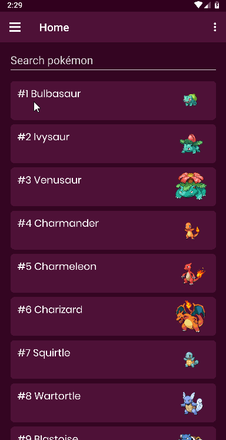

# Pokédex Little

[download apk here.]

[Angular + NativeScript] demo application featuring [PokéAPI].



## What's inside

### Home

1. Lists Kanto Pokédex.
2. Filter pokemon by name.
3. Select a pokémon
   - Display pokémon details.

### Pokédex

1. Lists all 14 pokédex.
2. Select one pokédex.
   - Display all pokémon, filtered by selected selected pokédex.
      - Filter pokemon by name.
      - Select a pokémon.
         - Display pokémon details.

### Pokémon

1. Lists all 18 pokémon types.
2. Select one pokémon type.
   - Display all pokémon, filtered by selected type.
      - Filter pokemon by name.
      - Select a pokémon.
         - Display pokémon details.

### Generation

1. Lists all 7 pokémon generations.
2. Select one generation.
   - Display all pokémon, filtered by generation.
      - Filter pokemon by name.
      - Select a pokémon.
         - Display pokémon details.

### Berries

1. Lists 64 kinds of berries
2. Select a berry.
   - Display berry details

### TODO

1. App Icon
2. Loading page
3. Pokémon moves
4. Pokémon items
5. Pokémon locations
6. Pokémon encounters
7. Pokémon machines
8. More Pokémon details

## Plugins used

 | Plugin            | Author              | Package                        |
 | :---------------- | :------------------ | :----------------------------- |
 | [UI Sidedrawer]   | [NativeScript Team] | `nativescript-ui-sidedrawer`   |
 | [Material Ripple] | [farfromrefuge]     | `nativescript-material-ripple` |

## Components used

1. `Button`
2. `Image`
3. `ActionBar`
4. `NavigationButton`
5. `ListView`
6. `ScrollView`
7. `RadSideDrawer`
8. `MDRipple` (plugin)

## Layouts used

1. `GridLayout`
2. `StackLayout`
3. `FlexboxLayout`

## Development Specs

**Mobile navigation pattern:** [SideDrawer Navigation]


### App generated using Nativescript CLI version 6.5.0

- **Template:** [tns-template-blank-ng]
- **Target Platform(s):** Android
- Nativescript v6.5.0
- Angular v9.0.7
- Angular CLI v8.2.0
- **OS:** Windows 10

### Emulator specs

- **Emulator:** Genymotion v3.0.4
- **Size:** 1440x2960
- **Density:** 560
- Android 9.0
- Android API 28

## Quick start

``` bash
> git clone https://github.com/ElecTreeFrying/pokedex-little.git
> cd pokedex-little
> npm install
> tns run android --env.uglify --env.aot
```

## Contributing

- Feel free to submit any pull requests. ✨✨✨
- Submit any issues, and feature requests in [GitHub Issues]. 🐹

## License

Apache License Version 2.0

[download apk here.]: https://www.dropbox.com/s/m5v0sxo12e6d666/pokedexlittle.apk?dl=0

[Angular + NativeScript]: https://www.nativescript.org/nativescript-is-how-you-build-native-mobile-apps-with-angular
[PokéAPI]: https://pokeapi.co/

[SideDrawer Navigation]: https://docs.nativescript.org/angular/core-concepts/angular-navigation#sidedrawer-navigation

[UI Sidedrawer]: https://market.nativescript.org/plugins/nativescript-ui-sidedrawer
[Material Ripple]: https://market.nativescript.org/plugins/nativescript-material-ripple

[NativeScript Team]: https://market.nativescript.org/author/tns-bot
[farfromrefuge]: https://market.nativescript.org/author/farfromrefuge

[tns-template-blank-ng]: https://market.nativescript.org/plugins/tns-template-blank-ng

[GitHub Issues]: https://github.com/ElecTreeFrying/pokedex-little/issues
